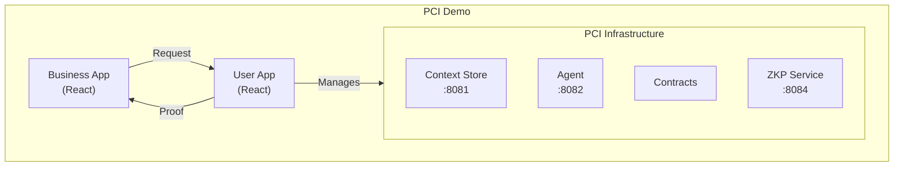

# PCI Demo

Interactive demonstration of Personal Context Infrastructure (PCI) showing privacy-preserving data sharing between users and businesses.

## Overview

This demo showcases:

- **User App** - Manage personal context, define S-PAL policies, approve/deny requests
- **Business App** - Request verified information without accessing raw data
- **Age Verification Flow** - Prove "user is >= 18" without revealing birth date

## Architecture



## Quick Start

```bash
# Start the full stack
docker compose up

# Access the apps
# User App:     http://localhost:3000
# Business App: http://localhost:3001
```

## Demo Scenario: Age Verification

### Step 1: User Setup
1. Open User App (http://localhost:3000)
2. Add your birth date to context store
3. Create S-PAL policy: "Allow age verification, no data retention"

### Step 2: Business Request
1. Open Business App (http://localhost:3001)
2. Click "Verify Customer Age"
3. Enter minimum age requirement (e.g., 18)

### Step 3: User Approval
1. User App shows incoming request
2. Review what's being requested
3. Approve or deny

### Step 4: Zero-Knowledge Proof
1. If approved, ZKP service generates proof
2. Business receives: `{ verified: true, minAge: 18 }`
3. Business does NOT receive: actual birth date

## Project Structure

```
pci-demo/
├── user-app/           # User-facing React application
├── business-app/       # Business-facing React application
├── shared/             # Shared types and utilities
├── scenarios/          # Pre-configured demo data
└── docker-compose.yml  # Full stack orchestration
```

## Development

```bash
# Install dependencies
pnpm install

# Start in dev mode (hot reload)
pnpm dev

# Run user-app only
pnpm --filter user-app dev

# Run business-app only
pnpm --filter business-app dev
```

## License

Apache 2.0
