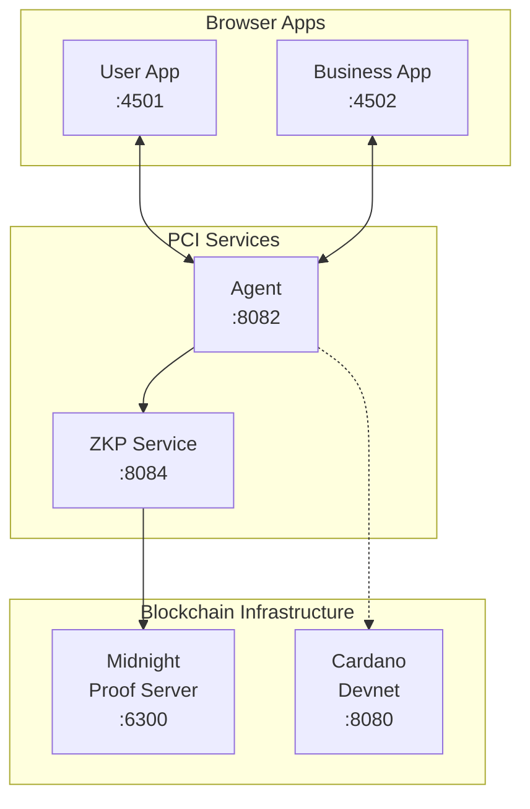
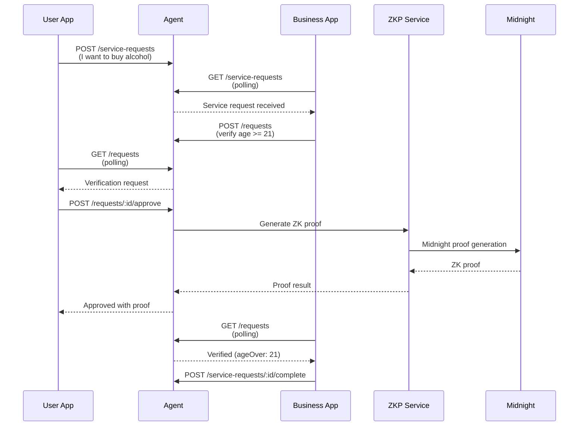

# PCI Demo

Interactive demonstration of Personal Context Infrastructure (PCI) showing privacy-preserving data sharing between users and businesses using zero-knowledge proofs.

## Overview

This demo showcases:

- **User App** - Request services, approve/deny verification requests, manage personal context
- **Business App** - Receive service requests, verify customer information without accessing raw data
- **Age Verification Flow** - Prove "user is >= 21" without revealing actual birth date

## Architecture



## Request Flow



## Quick Start

### Development Mode (recommended)

```bash
# Start backend services first (in separate terminals):

# Terminal 1: Cardano devnet (if not running)
# See yaci-devkit setup

# Terminal 2: ZKP service
cd ../pci-zkp && npx tsx sdk/src/server.ts

# Terminal 3: Agent
cd ../pci-agent && uv run python -m pci_agent

# Terminal 4: Frontend apps
cd pci-demo && pnpm dev
```

Access the apps:
- **User App:** http://localhost:4501
- **Business App:** http://localhost:4502

### Docker Compose

```bash
docker compose up --build

# User App:     http://localhost:4501
# Business App: http://localhost:4502
# Cardano Viewer: http://localhost:5173
```

### Deploy S-PAL Contracts (Optional)

Once the devnet is running, you can deploy S-PAL contracts:

```bash
# In a separate terminal, after docker compose is up:
cd ../pci-contracts
pnpm install
pnpm deploy:devnet

# Run integration tests against devnet:
pnpm test:integration
```

This deploys the S-PAL validator to the local Yaci Cardano devnet. Currently the demo works without deployed contracts (verification is off-chain), but contract deployment enables future on-chain policy enforcement.

## Demo Walkthrough

### 1. Request a Service (User App)
1. Open http://localhost:4501
2. Click "Request" on "Purchase Alcohol"
3. Watch the request appear in "My Requests"

### 2. Business Receives Request (Business App)
1. Open http://localhost:4502
2. See the incoming request under "Active Requests"
3. Notice "Awaiting Verification" badge

### 3. Approve Verification (User App)
1. Back in User App, see "Verification Required" section
2. Review what's being requested (age >= 21)
3. Click "Approve (Generate ZK Proof)"

### 4. Proof Generated
1. Business App shows **MIDNIGHT ZKP** badge (real proof)
2. Or **Fallback** badge (if Midnight unavailable)
3. Business sees `{ ageOver: 21 }` - NOT the birth date
4. Transaction completes automatically

## Service Status

Both apps show a status bar at the bottom:
- **Agent** - Request coordination service
- **Midnight ZKP** - Zero-knowledge proof generation
- **Cardano** - Blockchain with live block number

## Project Structure

```
pci-demo/
├── apps/
│   ├── user-app/        # User-facing React app
│   └── business-app/    # Business-facing React app
├── packages/
│   └── shared/          # Shared types
├── docker-compose.yml   # Full stack orchestration
└── pnpm-workspace.yaml  # Monorepo config
```

## Data Retention Enforcement

In this demo, the business app shows a disclaimer about "no retention" policies. In production, PCI enforces these policies through multiple mechanisms:

| Mechanism | Description | Status |
|-----------|-------------|--------|
| **Cryptographic Time-Locks** | Data encrypted with keys that automatically expire | Planned |
| **On-Chain Audit Trails** | All access events recorded on Cardano | Planned |
| **Threshold Decryption** | M-of-N community witnesses required for decryption | Planned |
| **Economic Incentives** | Businesses stake ADA collateral that can be slashed | Planned |
| **Graduated Trust** | New businesses have stricter requirements | Planned |

### How it works in production:

1. **Before sharing**: User checks business has sufficient stake on-chain
2. **During sharing**: Data is encrypted with time-locked keys, access recorded on Cardano
3. **After expiry**: Witnesses refuse to provide decryption shares
4. **Violation detected**: User submits claim to DAO, stake is slashed

See [PCI Technical Appendix - Data Retention Enforcement](../pci-docs/PCI_Technical_Appendix_v2.md#data-retention-enforcement) for full details.

## Related Repos

- **pci-agent** - Coordination service (Python)
- **pci-zkp** - ZKP service with Midnight integration
- **pci-contracts** - Aiken smart contracts for Cardano
- **pci-context-store** - Encrypted local data storage

## License

Apache 2.0
